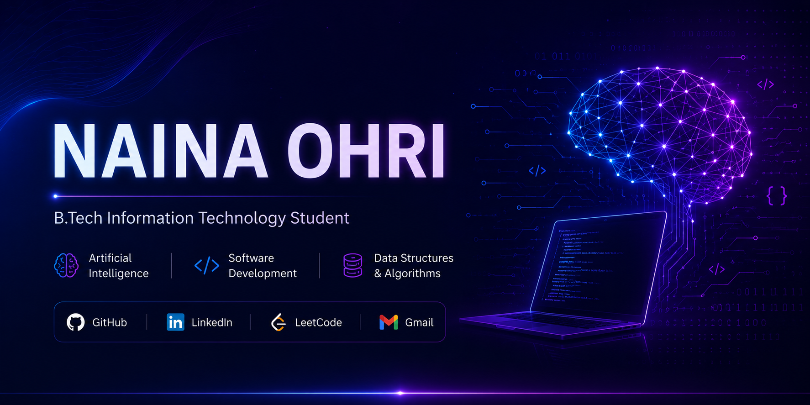

<!-- ========================================================= -->
<!--                           HERO                            -->
<!-- ========================================================= -->

<p align="center">
  
</p>

<p align="center">
  
</p>

<p align="center">
  <a href="https://github.com/Naina-Ohri">
    
  </a>
  &nbsp;&nbsp;&nbsp;
  <a href="https://www.linkedin.com/in/naina-ohri-476773327/">
    
  </a>
  &nbsp;&nbsp;&nbsp;
  <a href="https://leetcode.com/u/Naina_ohri/">
    
  </a>
  &nbsp;&nbsp;&nbsp;
  <a href="mailto:ohri.n.tech@gmail.com">
    
  </a>
</p>

<br>

<h1 align="center">
  Hi, I'm Naina 👋
</h1>

<h3 align="center">
  B.Tech Information Technology Student
</h3>

<p align="center">
  Artificial Intelligence • Software Development • Data Structures & Algorithms
</p>

<br>

<p align="center">
I'm a B.Tech Information Technology student with a passion for building practical software, exploring Artificial Intelligence, and solving problems through code.
</p>

<p align="center">
I'm currently strengthening my foundation in <b>Data Structures & Algorithms</b>, building hands-on projects, and expanding my knowledge of modern software development while growing one project and one commit at a time.
</p>

<p align="center">
My goal is to become a Software Engineer who creates impactful applications, contributes to Open Source, and never stops learning.
</p>

<br>

<p align="center">
<i>"Code with curiosity. Build with purpose."</i>
</p>

<br>

<!-- ========================================================= -->
<!-- ========================================================= -->
<!--                       TECH STACK                          -->
<!-- ========================================================= -->

<h2 align="center">💻 Tech Stack</h2>

<br>

<h3 align="center">Languages</h3>

<p align="center">
  
</p>

<br>

<h3 align="center">Tools & Technologies</h3>

<p align="center">
  
</p>

<br>

<h3 align="center">Currently Learning</h3>

<p align="center">
  
</p>

<p align="center">

🧠 Artificial Intelligence &nbsp;&nbsp;•&nbsp;&nbsp;
📊 Data Structures & Algorithms &nbsp;&nbsp;•&nbsp;&nbsp;
🌐 Web Development &nbsp;&nbsp;•&nbsp;&nbsp;
🤝 Open Source

</p>

<br>

<!-- ========================================================= -->
<!--                     GITHUB DASHBOARD                      -->
<!-- ========================================================= -->

<h2 align="center">📊 GitHub Dashboard</h2>

<br>

<p align="center">
  
  
</p>

<br>

<p align="center">
  
</p>

<br>

<p align="center">
  
</p>

<br>
<!-- Contribution Snake -->

<p align="center">
  <picture>
    <source
      media="(prefers-color-scheme: dark)"
      srcset="https://raw.githubusercontent.com/Naina-Ohri/Naina-Ohri/output/github-contribution-grid-snake-dark.svg"
    />
    <source
      media="(prefers-color-scheme: light)"
      srcset="https://raw.githubusercontent.com/Naina-Ohri/Naina-Ohri/output/github-contribution-grid-snake.svg"
    />
    
  </picture>
</p>

<br>

<p align="center">
  
</p>

<br>

<!-- The contribution snake will be added after your GitHub Action starts running -->

<p align="center">
  <i>🐍 Contribution Snake will appear here automatically once the GitHub Action is running.</i>
</p>

<br>

<!-- ========================================================= -->
<!-- ========================================================= -->
<!--                  FEATURED PROJECTS                        -->
<!-- ========================================================= -->

<h2 align="center">🚀 Featured Projects</h2>

<br>

<table>
<tr>

<td width="33%" valign="top">

### 🌐 Portfolio Website

A responsive personal portfolio showcasing my projects, skills, and learning journey.

**Tech Stack**

HTML • CSS • JavaScript

<br>

<a href="https://github.com/Naina-Ohri/Portfolio-Website">
View Repository →
</a>

</td>

<td width="33%" valign="top">

### 🧠 StudySync AI

An AI-inspired study planner designed to organize tasks, schedules, and boost productivity.

**Tech Stack**

HTML • CSS • JavaScript

<br>

<a href="https://github.com/Naina-Ohri/StudySync-AI">
View Repository →
</a>

</td>

<td width="33%" valign="top">

### 🤖 60 Days Claude Challenge

A collection of hands-on AI experiments, prompt engineering tasks, and daily learning documentation.

**Tech Stack**

Git • GitHub • Claude AI

<br>

<a href="https://github.com/Naina-Ohri/60-day-claude-challenge-">
View Repository →
</a>

</td>

</tr>
</table>

<br>
<br>

<!-- ========================================================= -->
<!--                    CERTIFICATIONS                         -->
<!-- ========================================================= -->

<h2 align="center">📜 Certifications</h2>

<br>

<table>
<tr>

<td width="50%" align="center">

## 🤖 IBM

### Artificial Intelligence Fundamentals

✅ Successfully Completed

</td>

<td width="50%" align="center">

## 💼 Microsoft × LinkedIn

### Career Essentials in Generative AI

✅ Successfully Completed

</td>

</tr>
</table>

<br>

<p align="center">
More certifications coming soon 🚀
</p>

<br>

<!-- ========================================================= -->
<!-- ========================================================= -->
<!--                    CURRENT FOCUS                          -->
<!-- ========================================================= -->

<h2 align="center">🎯 Current Focus</h2>

```yaml
current_focus:

  mastering:
    - Data Structures & Algorithms
    - Object-Oriented Programming
    - Artificial Intelligence Fundamentals
    - Problem Solving with LeetCode

  building:
    - AI-powered applications
    - Personal software projects
    - A strong GitHub portfolio
    - Practical programming skills

  exploring:
    - Machine Learning
    - Prompt Engineering
    - Modern Web Development
    - Open Source

  working_towards:
    - Software Engineering internships
    - AI/ML internships
    - Real-world development experience
    - Meaningful Open Source contributions
```

<br>

<!-- ========================================================= -->
<!--                    LET'S CONNECT                          -->
<!-- ========================================================= -->

<h2 align="center">🤝 Let's Connect</h2>

<br>

<p align="center">

<a href="https://github.com/Naina-Ohri">

</a>

<a href="https://www.linkedin.com/in/naina-ohri-476773327/">

</a>

<a href="https://leetcode.com/u/Naina_ohri/">

</a>

<a href="mailto:ohri.n.tech@gmail.com">

</a>

</p>

<br>

<!-- ========================================================= -->
<!--                         QUOTE                             -->
<!-- ========================================================= -->

<p align="center">

> *"Code with curiosity. Build with purpose."* 💜

</p>

<br>

<p align="center">

### ⭐ Thanks for visiting my profile!

If you enjoyed exploring my projects, feel free to ⭐ a repository or connect with me.

**Keep Learning • Keep Building • Keep Growing 🚀**

</p>

<!-- ========================================================= -->
<!--                         THE END                           -->
<!-- ========================================================= -->
